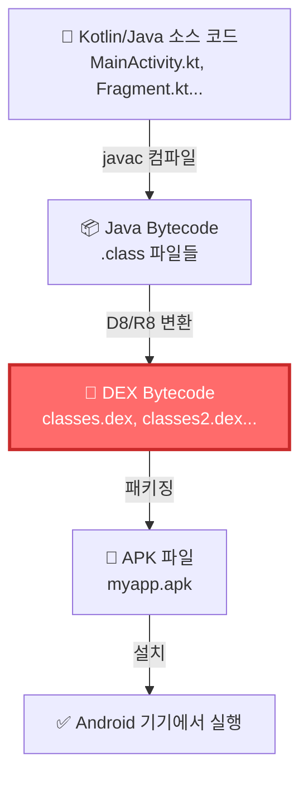
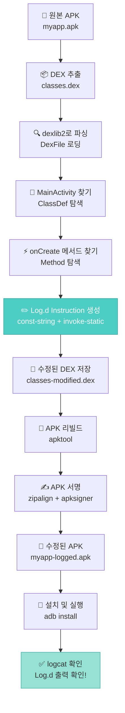
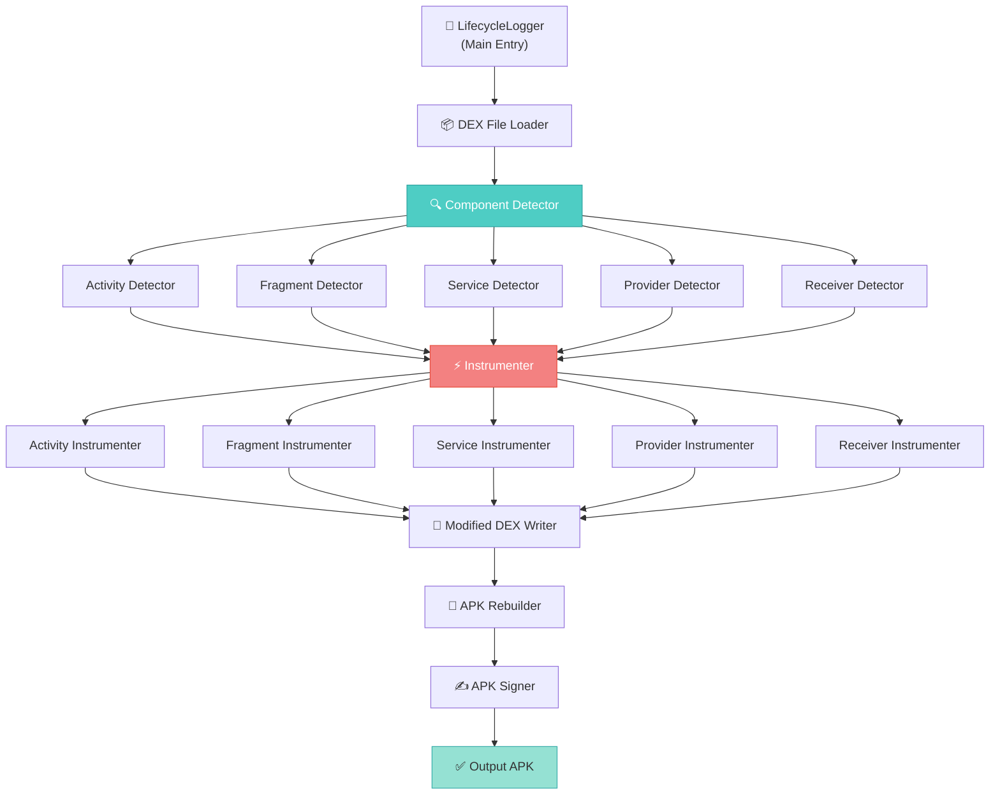

# Android DEX 바이트코드 수정 완벽 가이드

**dexlib2를 사용한 APK 수정 기술 마스터하기**

---

## 📚 서론 (Introduction)

### 🎯 이 문서에서 배우는 것

> **"소스 코드 없이 APK의 동작을 바꿀 수 있다면?"**

이 질문에 대한 답이 바로 **DEX 바이트코드 수정**입니다.

**상황 1**: 레거시 앱에 디버깅 로그를 추가하고 싶은데 소스 코드가 없다면?
**상황 2**: 서드파티 SDK의 버그를 패치하고 싶은데 수정할 수 없다면?
**상황 3**: 프로덕션 앱의 내부 동작을 분석하고 싶은데 난독화되어 있다면?

이 모든 상황에서 **DEX 바이트코드를 직접 수정**하면 해결할 수 있습니다.

### 💡 DEX 수정이 가능하게 하는 것들

컴파일된 APK 파일의 바이트코드를 직접 수정할 수 있다면:

```
✅ 소스 코드 없이도 앱 동작 변경 가능
✅ 모든 메서드에 자동으로 코드 삽입 가능
✅ 레거시 앱, 서드파티 SDK도 수정 가능
✅ APK 분석 및 리버스 엔지니어링 가능
✅ 자동화 도구 개발 가능
```

**실제 활용 사례**:
1. **모니터링/디버깅**: 자동 로깅, 성능 측정, 크래시 추적
2. **레거시 앱 개선**: 버그 패치, 새 기능 추가, API 호환성 수정
3. **보안 분석**: 앱 동작 분석, 취약점 탐지
4. **자동화 도구**: APK 자동 패치, CI/CD 통합

### 🎁 최종 결과물 미리보기

이 가이드를 완료하면 이런 도구를 만들 수 있습니다:

**Lifecycle Logger**: 모든 Android 컴포넌트의 라이프사이클을 자동으로 로깅

```bash
# 도구 실행
$ java -jar lifecycle-logger.jar myapp.apk myapp-logged.apk

📦 Processing APK: myapp.apk
🔍 Scanning DEX files...
   Found 3 DEX files

🎯 Detecting Android components...
   ✓ 45 Activities
   ✓ 23 Fragments
   ✓ 5 Services
   ✓ 2 ContentProviders

🔨 Adding lifecycle logs...
   ✓ MainActivity.onCreate(), onStart(), onResume(), ...
   ✓ HomeFragment.onCreateView(), onStart(), ...
   ✓ DataService.onCreate(), onStartCommand(), ...

✅ Done! Output: myapp-logged.apk

# 앱 실행 후 logcat
$ adb install myapp-logged.apk
$ adb logcat | grep LifecycleLogger

D/LifecycleLogger: SplashActivity.onCreate() START
D/LifecycleLogger: SplashActivity.onStart() START
D/LifecycleLogger: SplashActivity.onResume() START
D/LifecycleLogger: MainActivity.onCreate() START
D/LifecycleLogger: HomeFragment.onAttach() START
D/LifecycleLogger: HomeFragment.onCreate() START
D/LifecycleLogger: HomeFragment.onCreateView() START
D/LifecycleLogger: DataService.onCreate() START
D/LifecycleLogger: DataService.onStartCommand() START
```

**소스 코드 수정 없이 이 모든 로그가 자동으로 추가됩니다!**

### 📋 사전 요구사항

**필수**:
- ✅ **Java 11 이상** (JDK 또는 JRE)
- ✅ **Android 개발 기본 지식** (Activity, Fragment 개념)
- ✅ **Gradle 기본 사용법**
- ✅ **Android SDK** (Build Tools 포함)

**선택 (있으면 좋음)**:
- Java 바이트코드 경험 (없어도 됩니다!)
- 어셈블리 언어 지식 (없어도 됩니다!)

**불필요**:
- ❌ 리버스 엔지니어링 경험
- ❌ Smali 언어 지식
- ❌ DEX 포맷 상세 스펙 지식

### 🗺️ 학습 로드맵

```
서론 (10분)
    ↓
Part 1: 기초 이해 (30분)
    ├─ DEX가 뭔가요?
    ├─ DEX 파일 구조
    ├─ 레지스터 기반 VM
    └─ dexlib2 라이브러리 소개
    ↓
Part 2: Hello World (1시간) ⭐ 가장 중요!
    ├─ DEX 파일 읽기
    ├─ Log.d() 코드 삽입
    ├─ DEX 파일 쓰기
    ├─ APK 리빌드
    ├─ APK 서명
    └─ 실행 및 확인 (logcat)
    ↓
Part 3: 레지스터 관리 (30분) ⭐ 핵심!
    ├─ VerifyError의 정체
    ├─ Local vs Parameter 레지스터
    └─ Register Reuse 전략
    ↓
Part 4: 실전 프로젝트 (1시간)
    ├─ Activity 라이프사이클 로깅
    ├─ Fragment 로깅
    ├─ Service, ContentProvider 로깅
    └─ CLI 도구 완성
    ↓
Part 5: 마무리 (30분)
    ├─ 트러블슈팅
    ├─ 성능 최적화
    └─ 추가 응용 아이디어

총 소요 시간: 약 3.5시간
```

### 🎓 학습 방법

**1단계: 순서대로 읽기**
- 각 Part를 건너뛰지 말고 순서대로
- 코드 예제를 복사하지 말고 직접 타이핑
- 이해 안 되면 다시 읽기

**2단계: 실습하기**
- Part 2에서 실제로 Hello World 로그 찍어보기
- 오류가 나도 좌절하지 말기 (트러블슈팅 섹션 참고)
- 성공하면 다른 메서드에도 시도해보기

**3단계: 응용하기**
- Part 4 Lifecycle Logger를 직접 구현
- 자신만의 아이디어 추가 (실행 시간 측정, 파라미터 로깅 등)
- GitHub에 공개하기

### 📌 중요한 주의사항

**윤리적 사용**:
- ✅ 본인 앱, 오픈소스 앱에만 사용
- ✅ 학습 및 디버깅 목적
- ❌ 타인의 앱 무단 수정
- ❌ 악의적 목적 사용

**법적 준수**:
- 저작권 존중
- 라이선스 확인
- 개인정보 보호

### 🚀 준비 완료!

자, 이제 준비가 끝났습니다.

**DEX 바이트코드의 세계로 들어가 봅시다!**

다음 Part에서는 DEX가 무엇인지, 왜 중요한지부터 시작하겠습니다.

---

## Part 1: 기초 이해

### 1.1 DEX란 무엇인가?

#### DEX = Dalvik Executable

**DEX**는 Android 앱의 실행 파일 포맷입니다.

일반적인 Android 앱 빌드 과정:



**ASCII 버전** (Mermaid 미지원 환경용):
```
┌─────────────────────────────────────────────────┐
│ 📝 Kotlin/Java Source Code                     │
│ MainActivity.kt, HomeFragment.kt, ...           │
└───────────────────┬─────────────────────────────┘
                    │ javac 컴파일
                    ▼
┌─────────────────────────────────────────────────┐
│ 📦 Java Bytecode (.class)                      │
│ MainActivity.class, HomeFragment.class, ...     │
└───────────────────┬─────────────────────────────┘
                    │ D8/R8 변환
                    ▼
┏━━━━━━━━━━━━━━━━━━━━━━━━━━━━━━━━━━━━━━━━━━━━━━━┓
┃ 🎯 DEX Bytecode (.dex) ◄── 우리가 수정할 대상! ┃
┃ classes.dex, classes2.dex, classes3.dex, ...   ┃
┗━━━━━━━━━━━━━━━━━━┯━━━━━━━━━━━━━━━━━━━━━━━━━━━┛
                    │ 패키징 (aapt2)
                    ▼
┌─────────────────────────────────────────────────┐
│ 📱 APK File                                     │
│ myapp.apk                                       │
└───────────────────┬─────────────────────────────┘
                    │ 설치 (adb install)
                    ▼
┌─────────────────────────────────────────────────┐
│ ✅ Android 기기에서 실행                        │
└─────────────────────────────────────────────────┘
```

**핵심 포인트**:
- DEX는 **Java 바이트코드가 아닙니다**
- **Dalvik VM 전용 바이트코드**입니다
- APK 파일을 압축 해제하면 `classes.dex` 파일이 보입니다

#### 실제로 확인해보기

APK는 사실 ZIP 파일입니다:

```bash
# 1. APK 압축 해제
$ unzip myapp.apk -d extracted/

# 2. 내부 구조 확인
$ tree extracted/
```

**APK 내부 구조**:

```
myapp.apk (ZIP 파일)
├── 📄 AndroidManifest.xml
├── 📁 META-INF/
│   ├── MANIFEST.MF
│   ├── CERT.SF
│   └── CERT.RSA              (APK 서명)
├── 🎯 classes.dex            ◄── 우리가 수정할 대상!
├── 🎯 classes2.dex           ◄── 우리가 수정할 대상!
├── 🎯 classes3.dex           ◄── 우리가 수정할 대상!
├── 📁 res/
│   ├── layout/
│   │   ├── activity_main.xml
│   │   └── fragment_home.xml
│   ├── drawable/
│   │   └── ic_launcher.png
│   └── values/
│       └── strings.xml
├── 📁 lib/
│   ├── arm64-v8a/
│   │   └── libnative.so
│   ├── armeabi-v7a/
│   │   └── libnative.so
│   └── x86_64/
│       └── libnative.so
└── 📄 resources.arsc         (리소스 매핑 테이블)
```

**DEX 파일 확인**:

```bash
$ ls -lh extracted/*.dex

-rw-r--r--  2.4M  classes.dex      ← 메인 DEX (1,523 클래스)
-rw-r--r--  870K  classes2.dex     ← 멀티 DEX (456 클래스)
-rw-r--r--  340K  classes3.dex     ← 멀티 DEX (189 클래스)
```

**멀티 DEX란?**
- 하나의 DEX 파일에는 최대 **65,536개 메서드만 참조 가능** (64K 제한)
- 큰 앱은 여러 DEX 파일로 나뉨 (`classes.dex`, `classes2.dex`, ...)
- **우리 도구는 모든 DEX 파일을 자동으로 처리합니다!**

#### DEX vs JVM 바이트코드

| 특징 | JVM Bytecode | DEX Bytecode |
|------|--------------|--------------|
| VM | Java Virtual Machine | Dalvik/ART VM |
| 실행 방식 | **스택 기반** | **레지스터 기반** |
| 파일 포맷 | .class (클래스별) | .dex (전체 앱 통합) |
| 명령어 | ~200개 | ~218개 |
| 최적화 | JIT/AOT | AOT (ART) |

**가장 중요한 차이: 레지스터 기반!**

```
JVM (스택 기반):
    iload_1        // 스택에 변수 1 푸시
    iload_2        // 스택에 변수 2 푸시
    iadd           // 스택에서 2개 팝, 더하기, 결과 푸시
    istore_3       // 스택에서 팝, 변수 3에 저장

DEX (레지스터 기반):
    add-int v0, v1, v2    // v0 = v1 + v2
```

레지스터 기반이 더 간결하고 빠릅니다!

### 1.2 DEX 파일 구조

#### 클래스 디스크립터

DEX에서 클래스는 이렇게 표현됩니다:

```
클래스명: com.example.MainActivity
DEX 표현: Lcom/example/MainActivity;

규칙:
- L로 시작
- . 대신 /
- ; 으로 끝
```

**타입 디스크립터**:

| Java 타입 | DEX 표현 |
|-----------|----------|
| `int` | `I` |
| `long` | `J` |
| `float` | `F` |
| `double` | `D` |
| `boolean` | `Z` |
| `void` | `V` |
| `String` | `Ljava/lang/String;` |
| `Bundle` | `Landroid/os/Bundle;` |
| `int[]` | `[I` |
| `String[]` | `[Ljava/lang/String;` |

#### 메서드 시그니처

메서드는 이렇게 표현됩니다:

```java
// Java 코드
void onCreate(Bundle savedInstanceState)

// DEX 시그니처
onCreate(Landroid/os/Bundle;)V
        ↑ 파라미터 타입들    ↑ 리턴 타입

// 다른 예시들
setContentView(I)V                    // void setContentView(int)
findViewById(I)Landroid/view/View;    // View findViewById(int)
equals(Ljava/lang/Object;)Z           // boolean equals(Object)
<init>()V                             // 생성자
```

#### 레지스터 구조 (핵심!)

DEX는 **레지스터 기반 VM**이므로 레지스터를 이해하는 것이 가장 중요합니다.

**레지스터의 종류**:

```
v0, v1, v2, ...  → Local registers (지역 변수)
p0, p1, p2, ...  → Parameter registers (파라미터)
```

**예시 메서드**:

```java
// Java 코드
void onCreate(Bundle savedInstanceState) {
    String tag = "MainActivity";
    Log.d(tag, "onCreate called");
}

// DEX 메서드 정의
.method protected onCreate(Landroid/os/Bundle;)V
    .registers 3        // 총 3개 레지스터 사용

    // 레지스터 배치:
    // v0 = tag (지역 변수)
    // p0 = this (첫 번째 파라미터, 인스턴스 메서드는 항상 this)
    // p1 = savedInstanceState (두 번째 파라미터)
```

**메모리 레이아웃 시각화**:

```
┏━━━━━━━━━━━━━━━━━━━━━━━━━━━━━━━━━━━━━━━━━━━━━┓
┃  onCreate(Bundle) 메서드의 레지스터 메모리   ┃
┣━━━━━━━┯━━━━━━━━━┯━━━━━━━━━━━━━━━━━━━━━━━━━┫
┃ Index │  Name   │  Value/Type             ┃
┣━━━━━━━┿━━━━━━━━━┿━━━━━━━━━━━━━━━━━━━━━━━━━┫
┃   0   │   v0    │ "MainActivity" (String) ┃ ◄─ Local register
┣━━━━━━━┿━━━━━━━━━┿━━━━━━━━━━━━━━━━━━━━━━━━━┫
┃   1   │   p0    │ this (MainActivity)     ┃ ◄─ Parameter (this)
┣━━━━━━━┿━━━━━━━━━┿━━━━━━━━━━━━━━━━━━━━━━━━━┫
┃   2   │   p1    │ savedInstanceState      ┃ ◄─ Parameter
┃       │         │ (Bundle)                ┃
┗━━━━━━━┷━━━━━━━━━┷━━━━━━━━━━━━━━━━━━━━━━━━━┛

총 3개 레지스터 (.registers 3)
- Local: 1개 (v0)
- Parameters: 2개 (p0=this, p1=Bundle)
```

**중요한 규칙**:

1. **인스턴스 메서드**는 `p0 = this` (항상!)
   ```java
   void onCreate(Bundle b)  → p0=this, p1=Bundle
   void onClick(View v)     → p0=this, p1=View
   ```

2. **정적 메서드**는 `p0 = 첫 번째 인자`
   ```java
   static void log(String tag, String msg) → p0=tag, p1=msg
   ```

3. **Local 레지스터가 먼저, Parameter 레지스터가 나중**
   ```
   [v0, v1, v2, ...] → [p0, p1, p2, ...]
   ↑ 지역 변수          ↑ 메서드 파라미터
   ```

**이 구조가 Part 3 "레지스터 관리"에서 핵심이 됩니다!**

### 1.3 Dalvik 바이트코드 기초

#### 자주 쓰는 Opcode TOP 10

DEX에는 218개의 opcode가 있지만, 우리가 자주 쓸 건 10개 정도입니다.

**1. const-string** - 문자열 로딩

```smali
const-string v0, "MainActivity"
# → v0 레지스터에 "MainActivity" 문자열 저장
```

**2. const** - 정수 로딩

```smali
const v0, 0x7f0b001c
# → v0 레지스터에 정수 0x7f0b001c 저장 (예: R.layout.activity_main)
```

**3. invoke-static** - 정적 메서드 호출

```smali
invoke-static {v0, v1}, Landroid/util/Log;->d(Ljava/lang/String;Ljava/lang/String;)I
# → Log.d(v0, v1) 호출
# {v0, v1} = 인자들
```

**4. invoke-virtual** - 인스턴스 메서드 호출

```smali
invoke-virtual {p0, v0}, Lcom/example/MainActivity;->setContentView(I)V
# → this.setContentView(v0) 호출
# p0 = this
```

**5. invoke-super** - 부모 메서드 호출

```smali
invoke-super {p0, p1}, Landroid/app/Activity;->onCreate(Landroid/os/Bundle;)V
# → super.onCreate(p1) 호출
```

**6. move-result** - 반환값 저장

```smali
invoke-virtual {p0, v0}, Lcom/example/MainActivity;->findViewById(I)Landroid/view/View;
move-result-object v1
# → v1 = this.findViewById(v0)
# 반환값을 v1에 저장
```

**7. return-void** - void 반환

```smali
return-void
# → 메서드 종료 (반환값 없음)
```

**8. return** - 값 반환

```smali
return v0
# → v0를 반환하고 메서드 종료
```

**9. if-eqz** - 조건 분기

```smali
if-eqz v0, :cond_0
# → v0이 0이면 :cond_0으로 점프
```

**10. goto** - 무조건 점프

```smali
goto :label_1
# → :label_1로 점프
```

#### 실제 메서드 예시

Java 코드를 DEX 바이트코드로 변환하면:

```java
// Java 코드
protected void onCreate(Bundle savedInstanceState) {
    super.onCreate(savedInstanceState);
    setContentView(R.layout.activity_main);
}
```

```smali
# DEX 바이트코드 (Smali 표기)
.method protected onCreate(Landroid/os/Bundle;)V
    .registers 2                    # 총 2개 레지스터
    .param p1, "savedInstanceState" # p1 = Bundle

    # super.onCreate(savedInstanceState)
    invoke-super {p0, p1}, Landroid/app/Activity;->onCreate(Landroid/os/Bundle;)V

    # setContentView(R.layout.activity_main)
    const v0, 0x7f0b001c           # v0 = R.layout.activity_main
    invoke-virtual {p0, v0}, Lcom/example/MainActivity;->setContentView(I)V

    return-void
.end method
```

**우리가 추가할 코드** (Log.d() 호출):

```smali
# Log.d("TAG", "MainActivity.onCreate() called")
const-string v0, "TAG"
const-string v1, "MainActivity.onCreate() called"
invoke-static {v0, v1}, Landroid/util/Log;->d(Ljava/lang/String;Ljava/lang/String;)I
```

### 1.4 dexlib2 라이브러리

#### dexlib2란?

**dexlib2**는 DEX 파일을 읽고, 수정하고, 쓸 수 있는 Java 라이브러리입니다.

**특징**:
- ✅ DEX 파일 파싱 및 쓰기
- ✅ 클래스, 메서드, 필드 탐색
- ✅ Instruction (바이트코드) 수정
- ✅ Smali 문법 불필요 (Java API로 모든 작업 가능)

**공식 저장소**: https://github.com/JesusFreke/smali

#### Gradle 설정

```gradle
// build.gradle.kts
dependencies {
    // dexlib2 라이브러리
    implementation("com.android.tools.smali:smali-dexlib2:3.0.3")

    // dexlib2 의존성
    implementation("com.google.guava:guava:31.1-jre")
}
```

#### 주요 인터페이스 5개

**1. DexFile** - DEX 파일 전체

```java
import com.android.tools.smali.dexlib2.*;

DexFile dexFile = DexFileFactory.loadDexFile(
    new File("classes.dex"),
    Opcodes.getDefault()
);

// 모든 클래스 접근
for (ClassDef classDef : dexFile.getClasses()) {
    System.out.println(classDef.getType());
}
```

**2. ClassDef** - 클래스 정의

```java
import com.android.tools.smali.dexlib2.iface.ClassDef;

for (ClassDef classDef : dexFile.getClasses()) {
    String className = classDef.getType();        // Lcom/example/MainActivity;
    String superclass = classDef.getSuperclass(); // Landroid/app/Activity;

    // 메서드 접근
    for (Method method : classDef.getMethods()) {
        // ...
    }
}
```

**3. Method** - 메서드

```java
import com.android.tools.smali.dexlib2.iface.Method;

for (Method method : classDef.getMethods()) {
    String name = method.getName();              // onCreate
    List<? extends CharSequence> params = method.getParameters(); // [Landroid/os/Bundle;]
    String returnType = method.getReturnType();  // V

    // 메서드 바디 (코드) 접근
    MethodImplementation impl = method.getImplementation();
}
```

**4. MethodImplementation** - 메서드 바디 (코드)

```java
import com.android.tools.smali.dexlib2.iface.MethodImplementation;

MethodImplementation impl = method.getImplementation();
if (impl != null) {
    int registerCount = impl.getRegisterCount();  // 레지스터 개수
    Iterable<? extends Instruction> instructions = impl.getInstructions(); // 명령어들
}
```

**5. Instruction** - 바이트코드 명령어

```java
import com.android.tools.smali.dexlib2.iface.instruction.Instruction;

for (Instruction instruction : impl.getInstructions()) {
    Opcode opcode = instruction.getOpcode();  // INVOKE_SUPER, CONST_STRING, ...
    // ...
}
```

#### 첫 코드 실행 (DEX 읽기)

```java
import com.android.tools.smali.dexlib2.*;
import com.android.tools.smali.dexlib2.iface.*;
import java.io.File;

public class DexReader {
    public static void main(String[] args) throws Exception {
        // 1. DEX 파일 로딩
        File dexFile = new File("classes.dex");
        DexFile dex = DexFileFactory.loadDexFile(dexFile, Opcodes.getDefault());

        System.out.println("총 클래스 개수: " + dex.getClasses().size());

        // 2. MainActivity 찾기
        for (ClassDef classDef : dex.getClasses()) {
            if (classDef.getType().contains("MainActivity")) {
                System.out.println("\n클래스: " + classDef.getType());
                System.out.println("부모 클래스: " + classDef.getSuperclass());

                // 3. 메서드 목록 출력
                System.out.println("\n메서드 목록:");
                for (Method method : classDef.getMethods()) {
                    System.out.println("  " + method.getName() + method.getParameters() + method.getReturnType());
                }
            }
        }
    }
}
```

**실행 결과**:

```
총 클래스 개수: 1523

클래스: Lcom/example/MainActivity;
부모 클래스: Landroidx/appcompat/app/AppCompatActivity;

메서드 목록:
  <init>()V
  onCreate(Landroid/os/Bundle;)V
  onStart()V
  onResume()V
  onPause()V
```

**성공!** 이제 DEX 파일을 읽을 수 있습니다.

---

Part 1 요약: DEX의 기본 개념을 이해했습니다.
- DEX = Dalvik Executable
- 레지스터 기반 VM
- dexlib2로 DEX 읽기

**다음 Part에서는 실제로 DEX를 수정해봅니다!**

---

## Part 2: Hello World - 전체 과정

이제 실전입니다! `MainActivity.onCreate()`에 `Log.d()` 코드를 삽입하고, APK를 다시 빌드해서 실행까지 해보겠습니다.

### 전체 워크플로우



**ASCII 버전**:
```
┌────────────────────┐
│ 📱 원본 APK        │
│ myapp.apk          │
└─────────┬──────────┘
          │ unzip/ZipFile
          ▼
┌────────────────────┐
│ 📦 DEX 추출        │
│ classes.dex        │
└─────────┬──────────┘
          │ DexFileFactory.loadDexFile
          ▼
┌────────────────────┐
│ 🔍 dexlib2 파싱    │
│ DexFile            │
└─────────┬──────────┘
          │ for (ClassDef)
          ▼
┌────────────────────┐
│ 🎯 MainActivity    │
│ ClassDef           │
└─────────┬──────────┘
          │ for (Method)
          ▼
┌────────────────────┐
│ ⚡ onCreate 메서드 │
│ Method + Impl      │
└─────────┬──────────┘
          │ Instruction 생성 및 삽입
          ▼
┏━━━━━━━━━━━━━━━━━━━━┓
┃ ✏️ Log.d 삽입      ┃
┃ const-string       ┃
┃ invoke-static      ┃
┗━━━━━━━━┯━━━━━━━━━━━┛
          │ DexFileFactory.writeDexFile
          ▼
┌────────────────────┐
│ 💾 수정된 DEX      │
│ classes.dex        │
└─────────┬──────────┘
          │ APK 재조립
          ▼
┌────────────────────┐
│ 🔨 APK 리빌드      │
│ apktool b          │
└─────────┬──────────┘
          │ 서명
          ▼
┌────────────────────┐
│ ✍️ APK 서명        │
│ zipalign+apksigner │
└─────────┬──────────┘
          │
          ▼
┌────────────────────┐
│ 📱 완성!           │
│ myapp-logged.apk   │
└─────────┬──────────┘
          │ adb install
          ▼
┌────────────────────┐
│ ✅ 실행 및 확인    │
│ adb logcat         │
│ → Log.d 출력! 🎉   │
└────────────────────┘
```

### 2.1 목표

```java
// 변환 전
class MainActivity : AppCompatActivity() {
    override fun onCreate(savedInstanceState: Bundle?) {
        super.onCreate(savedInstanceState)
        setContentView(R.layout.activity_main)
    }
}

// 변환 후
class MainActivity : AppCompatActivity() {
    override fun onCreate(savedInstanceState: Bundle?) {
        Log.d("HELLO_DEX", "MainActivity.onCreate() called!")  // ← 자동 추가!
        super.onCreate(savedInstanceState)
        setContentView(R.layout.activity_main)
    }
}
```

### 2.2 전체 워크플로우

```
APK 파일
    ↓ (1) DEX 추출
classes.dex
    ↓ (2) DEX 읽기 (dexlib2)
메모리 상의 ClassDef, Method 객체들
    ↓ (3) Instruction 추가 (Log.d 호출)
수정된 Method 객체들
    ↓ (4) DEX 쓰기 (dexlib2)
classes_modified.dex
    ↓ (5) APK 리빌드 (apktool)
unsigned.apk
    ↓ (6) APK 서명 (apksigner)
signed.apk
    ↓ (7) 설치 및 실행
adb logcat에서 로그 확인!
```

### 2.3 Step 1: DEX 파일 추출

APK는 ZIP 파일이므로 압축 해제하면 됩니다.

```java
import java.io.*;
import java.util.zip.*;

public class DexExtractor {
    public static void extractDex(File apkFile, File outputDir) throws IOException {
        outputDir.mkdirs();

        try (ZipFile zipFile = new ZipFile(apkFile)) {
            Enumeration<? extends ZipEntry> entries = zipFile.entries();

            while (entries.hasMoreElements()) {
                ZipEntry entry = entries.nextElement();
                String name = entry.getName();

                // classes.dex, classes2.dex, ... 추출
                if (name.matches("classes\\d*\\.dex")) {
                    System.out.println("Extracting: " + name);

                    File outputFile = new File(outputDir, name);
                    try (InputStream in = zipFile.getInputStream(entry);
                         FileOutputStream out = new FileOutputStream(outputFile)) {

                        byte[] buffer = new byte[8192];
                        int len;
                        while ((len = in.read(buffer)) > 0) {
                            out.write(buffer, 0, len);
                        }
                    }
                }
            }
        }
    }
}
```

**사용**:

```java
File apk = new File("myapp.apk");
File outputDir = new File("dex_extracted");

DexExtractor.extractDex(apk, outputDir);

// 결과:
// dex_extracted/classes.dex
// dex_extracted/classes2.dex
// dex_extracted/classes3.dex
```

### 2.4 Step 2: DEX 수정 (핵심!)

이제 `MainActivity.onCreate()`를 찾아서 Log.d() 코드를 추가합니다.

```java
import com.android.tools.smali.dexlib2.*;
import com.android.tools.smali.dexlib2.iface.*;
import com.android.tools.smali.dexlib2.iface.instruction.*;
import com.android.tools.smali.dexlib2.immutable.*;
import com.android.tools.smali.dexlib2.immutable.instruction.*;
import com.android.tools.smali.dexlib2.immutable.reference.*;

import java.io.File;
import java.util.*;

public class DexModifier {

    public static void modifyDex(File inputDex, File outputDex) throws Exception {
        // 1. DEX 파일 로딩
        DexFile dexFile = DexFileFactory.loadDexFile(inputDex, Opcodes.getDefault());
        System.out.println("[INFO] Loaded DEX: " + dexFile.getClasses().size() + " classes");

        // 2. 수정된 클래스들을 저장할 Set
        Set<ClassDef> modifiedClasses = new HashSet<>();

        // 3. 모든 클래스 탐색
        for (ClassDef classDef : dexFile.getClasses()) {
            // MainActivity 찾기
            if (classDef.getType().contains("MainActivity")) {
                System.out.println("[FOUND] " + classDef.getType());

                // MainActivity에 로그 추가
                ClassDef modified = addLogToActivity(classDef);
                modifiedClasses.add(modified);
            } else {
                // 나머지 클래스는 그대로
                modifiedClasses.add(classDef);
            }
        }

        // 4. 새로운 DEX 파일 쓰기
        writeDexFile(modifiedClasses, outputDex);
        System.out.println("[DONE] Output: " + outputDex);
    }

    /**
     * MainActivity에 로그 추가
     */
    private static ClassDef addLogToActivity(ClassDef classDef) {
        List<Method> modifiedMethods = new ArrayList<>();

        for (Method method : classDef.getMethods()) {
            // onCreate 메서드 찾기
            if (method.getName().equals("onCreate") &&
                method.getParameters().size() == 1 &&
                method.getParameters().get(0).toString().equals("Landroid/os/Bundle;")) {

                System.out.println("  [MODIFY] onCreate()");

                // onCreate에 로그 추가
                Method modified = addLogToMethod(method, "MainActivity.onCreate() called!");
                modifiedMethods.add(modified);
            } else {
                // 나머지 메서드는 그대로
                modifiedMethods.add(method);
            }
        }

        // 수정된 메서드로 새 ClassDef 생성
        return new ImmutableClassDef(
            classDef.getType(),
            classDef.getAccessFlags(),
            classDef.getSuperclass(),
            classDef.getInterfaces(),
            classDef.getSourceFile(),
            classDef.getAnnotations(),
            classDef.getFields(),
            modifiedMethods
        );
    }

    /**
     * 메서드에 Log.d() 코드 추가
     */
    private static Method addLogToMethod(Method method, String message) {
        MethodImplementation impl = method.getImplementation();
        if (impl == null) {
            return method; // Abstract 메서드는 스킵
        }

        // 기존 instructions를 List로 변환
        List<Instruction> instructions = new ArrayList<>();
        for (Instruction inst : impl.getInstructions()) {
            instructions.add(inst);
        }

        // Log.d() 코드 생성
        List<Instruction> logInstructions = createLogInstructions(message);

        // 메서드 맨 앞에 삽입 (인덱스 0)
        instructions.addAll(0, logInstructions);

        System.out.println("    Added " + logInstructions.size() + " instructions");

        // 새로운 MethodImplementation 생성
        ImmutableMethodImplementation newImpl = new ImmutableMethodImplementation(
            impl.getRegisterCount(),  // 레지스터 개수 유지 (중요!)
            instructions,
            impl.getTryBlocks(),
            impl.getDebugItems()
        );

        // 새로운 Method 반환
        return new ImmutableMethod(
            method.getDefiningClass(),
            method.getName(),
            method.getParameters(),
            method.getReturnType(),
            method.getAccessFlags(),
            method.getAnnotations(),
            method.getHiddenApiRestrictions(),
            newImpl
        );
    }

    /**
     * Log.d("HELLO_DEX", message) 코드 생성
     */
    private static List<Instruction> createLogInstructions(String message) {
        List<Instruction> instructions = new ArrayList<>();

        // const-string v0, "HELLO_DEX"
        instructions.add(new ImmutableInstruction21c(
            Opcode.CONST_STRING,
            0,  // 레지스터 v0
            new ImmutableStringReference("HELLO_DEX")
        ));

        // const-string v1, message
        instructions.add(new ImmutableInstruction21c(
            Opcode.CONST_STRING,
            1,  // 레지스터 v1
            new ImmutableStringReference(message)
        ));

        // invoke-static {v0, v1}, Landroid/util/Log;->d(Ljava/lang/String;Ljava/lang/String;)I
        instructions.add(new ImmutableInstruction35c(
            Opcode.INVOKE_STATIC,
            2,  // 인자 개수
            0,  // v0 (TAG)
            1,  // v1 (message)
            0, 0, 0,  // 나머지 unused
            new ImmutableMethodReference(
                "Landroid/util/Log;",  // 클래스
                "d",                    // 메서드명
                List.of("Ljava/lang/String;", "Ljava/lang/String;"),  // 파라미터 타입
                "I"  // 반환 타입 (int)
            )
        ));

        return instructions;
    }

    /**
     * 수정된 클래스들을 DEX 파일로 쓰기
     */
    private static void writeDexFile(Set<ClassDef> classes, File outputFile) throws Exception {
        // DexFile 생성
        ImmutableDexFile dexFile = new ImmutableDexFile(
            Opcodes.getDefault(),
            classes
        );

        // DexPool로 쓰기
        DexPool dexPool = new DexPool(Opcodes.getDefault());
        for (ClassDef classDef : dexFile.getClasses()) {
            dexPool.internClass(classDef);
        }

        // 파일로 저장
        dexPool.writeTo(new com.android.tools.smali.dexlib2.writer.io.FileDataStore(outputFile));
    }
}
```

**사용**:

```java
File inputDex = new File("dex_extracted/classes.dex");
File outputDex = new File("dex_modified/classes.dex");

DexModifier.modifyDex(inputDex, outputDex);
```

**실행 결과**:

```
[INFO] Loaded DEX: 1523 classes
[FOUND] Lcom/example/myapp/MainActivity;
  [MODIFY] onCreate()
    Added 3 instructions
[DONE] Output: dex_modified/classes.dex
```

### 2.5 Step 3: APK 리빌드

수정된 DEX를 다시 APK로 패키징합니다.

**필요한 도구**: apktool (APK 디컴파일/리빌드 도구)

```bash
# apktool 다운로드 (한 번만)
wget https://raw.githubusercontent.com/iBotPeaches/Apktool/master/scripts/linux/apktool
wget https://bitbucket.org/iBotPeaches/apktool/downloads/apktool_2.9.3.jar
chmod +x apktool

# APK 디컴파일
./apktool d myapp.apk -o myapp_decompiled

# 수정된 DEX 복사
cp dex_modified/classes.dex myapp_decompiled/classes.dex

# APK 리빌드
./apktool b myapp_decompiled -o myapp_unsigned.apk
```

Java에서 실행:

```java
import java.io.*;

public class ApkRebuilder {

    public static void rebuildApk(File apkFile, File modifiedDexDir, File outputApk) throws Exception {
        File workDir = new File("apk_work");
        File decompiledDir = new File(workDir, "decompiled");

        // 1. APK 디컴파일
        System.out.println("[STEP 1] Decompiling APK...");
        ProcessBuilder decompile = new ProcessBuilder(
            "apktool", "d", "-f",
            apkFile.getAbsolutePath(),
            "-o", decompiledDir.getAbsolutePath()
        );
        runProcess(decompile);

        // 2. 수정된 DEX 복사
        System.out.println("[STEP 2] Copying modified DEX...");
        copyModifiedDex(modifiedDexDir, decompiledDir);

        // 3. APK 리빌드
        System.out.println("[STEP 3] Rebuilding APK...");
        ProcessBuilder rebuild = new ProcessBuilder(
            "apktool", "b",
            decompiledDir.getAbsolutePath(),
            "-o", outputApk.getAbsolutePath()
        );
        runProcess(rebuild);

        System.out.println("[DONE] Rebuilt APK: " + outputApk);
    }

    private static void runProcess(ProcessBuilder pb) throws Exception {
        pb.inheritIO();
        Process process = pb.start();
        int exitCode = process.waitFor();
        if (exitCode != 0) {
            throw new RuntimeException("Process failed with exit code: " + exitCode);
        }
    }

    private static void copyModifiedDex(File modifiedDexDir, File decompiledDir) throws IOException {
        File[] dexFiles = modifiedDexDir.listFiles((dir, name) -> name.endsWith(".dex"));
        for (File dex : dexFiles) {
            File target = new File(decompiledDir, dex.getName());
            Files.copy(dex.toPath(), target.toPath(), StandardCopyOption.REPLACE_EXISTING);
            System.out.println("  Copied: " + dex.getName());
        }
    }
}
```

### 2.6 Step 4: APK 서명

Android는 서명된 APK만 설치 가능합니다.

**필요한 도구**: zipalign, apksigner (Android SDK Build Tools)

```bash
# zipalign (4바이트 정렬)
zipalign -f -p 4 myapp_unsigned.apk myapp_aligned.apk

# apksigner (v2/v3 서명)
apksigner sign \
    --ks ~/.android/debug.keystore \
    --ks-pass pass:android \
    --key-pass pass:android \
    --ks-key-alias androiddebugkey \
    --out myapp_signed.apk \
    myapp_aligned.apk

# 서명 확인
apksigner verify -v myapp_signed.apk
```

Java에서 실행:

```java
public class ApkSigner {

    public static void signApk(File unsignedApk, File signedApk) throws Exception {
        File alignedApk = new File(unsignedApk.getParent(), "aligned.apk");

        // 1. zipalign
        System.out.println("[STEP 1] Aligning APK...");
        ProcessBuilder zipalign = new ProcessBuilder(
            "zipalign", "-f", "-p", "4",
            unsignedApk.getAbsolutePath(),
            alignedApk.getAbsolutePath()
        );
        runProcess(zipalign);

        // 2. apksigner
        System.out.println("[STEP 2] Signing APK...");
        String keystorePath = System.getProperty("user.home") + "/.android/debug.keystore";

        ProcessBuilder apksigner = new ProcessBuilder(
            "apksigner", "sign",
            "--ks", keystorePath,
            "--ks-pass", "pass:android",
            "--key-pass", "pass:android",
            "--ks-key-alias", "androiddebugkey",
            "--out", signedApk.getAbsolutePath(),
            alignedApk.getAbsolutePath()
        );
        runProcess(apksigner);

        System.out.println("[DONE] Signed APK: " + signedApk);
    }

    private static void runProcess(ProcessBuilder pb) throws Exception {
        pb.inheritIO();
        Process process = pb.start();
        int exitCode = process.waitFor();
        if (exitCode != 0) {
            throw new RuntimeException("Process failed with exit code: " + exitCode);
        }
    }
}
```

### 2.7 Step 5: 설치 및 실행

드디어 마지막 단계입니다!

```bash
# 기존 앱 제거 (서명이 다르면 설치 안 됨)
adb uninstall com.example.myapp

# 수정된 APK 설치
adb install myapp_signed.apk

# 앱 실행
adb shell am start -n com.example.myapp/.MainActivity

# logcat으로 로그 확인
adb logcat | grep HELLO_DEX
```

**성공하면 이렇게 출력됩니다**:

```
D/HELLO_DEX: MainActivity.onCreate() called!
```

**축하합니다! 🎉**

소스 코드 수정 없이 DEX 바이트코드를 직접 수정해서 로그를 추가했습니다!

### 2.8 전체 코드 통합

지금까지의 모든 단계를 하나로 합치면:

```java
import java.io.File;

public class Main {

    public static void main(String[] args) throws Exception {
        File inputApk = new File("myapp.apk");
        File outputApk = new File("myapp_modified.apk");

        System.out.println("=".repeat(50));
        System.out.println("DEX Bytecode Modifier");
        System.out.println("=".repeat(50));

        // Step 1: DEX 추출
        File dexExtracted = new File("work/dex_extracted");
        DexExtractor.extractDex(inputApk, dexExtracted);

        // Step 2: DEX 수정
        File dexModified = new File("work/dex_modified");
        dexModified.mkdirs();

        File inputDex = new File(dexExtracted, "classes.dex");
        File outputDex = new File(dexModified, "classes.dex");
        DexModifier.modifyDex(inputDex, outputDex);

        // Step 3 & 4: APK 리빌드 및 서명
        File unsignedApk = new File("work/unsigned.apk");
        ApkRebuilder.rebuildApk(inputApk, dexModified, unsignedApk);
        ApkSigner.signApk(unsignedApk, outputApk);

        System.out.println("\n" + "=".repeat(50));
        System.out.println("SUCCESS!");
        System.out.println("Output: " + outputApk.getAbsolutePath());
        System.out.println("=".repeat(50));
        System.out.println("\nNext steps:");
        System.out.println("  adb install " + outputApk.getAbsolutePath());
        System.out.println("  adb logcat | grep HELLO_DEX");
    }
}
```

**실행**:

```bash
$ java Main

==================================================
DEX Bytecode Modifier
==================================================
Extracting: classes.dex
[INFO] Loaded DEX: 1523 classes
[FOUND] Lcom/example/myapp/MainActivity;
  [MODIFY] onCreate()
    Added 3 instructions
[DONE] Output: work/dex_modified/classes.dex
[STEP 1] Decompiling APK...
[STEP 2] Copying modified DEX...
  Copied: classes.dex
[STEP 3] Rebuilding APK...
[STEP 1] Aligning APK...
[STEP 2] Signing APK...

==================================================
SUCCESS!
Output: /path/to/myapp_modified.apk
==================================================

Next steps:
  adb install /path/to/myapp_modified.apk
  adb logcat | grep HELLO_DEX
```

---

Part 2 완료! 실제로 DEX를 수정하고 APK로 만들어서 실행까지 성공했습니다.

**하지만 문제가 있습니다...**

### ⚠️ 주의사항

위 코드에는 중요한 문제가 숨어있습니다:

```java
// createLogInstructions()에서
instructions.add(new ImmutableInstruction21c(
    Opcode.CONST_STRING,
    0,  // ← v0 레지스터 사용
    ...
));
```

**문제**: 기존 메서드가 이미 v0를 사용하고 있다면?

```smali
# 기존 메서드 (onCreate)
.method onCreate(Landroid/os/Bundle;)V
    .registers 2

    const v0, 0x7f0b001c    # v0 = R.layout.activity_main
    invoke-virtual {p0, v0}, ...
```

우리가 추가한 코드:

```smali
const-string v0, "HELLO_DEX"  # ← v0 덮어씀!
const-string v1, "..."
invoke-static {v0, v1}, ...

const v0, 0x7f0b001c  # ← 기존 코드, v0 다시 씀 (문제없음)
```

**이 경우는 운좋게 괜찮습니다.** 왜냐하면:
1. 우리가 v0를 먼저 씀
2. Log.d() 호출 후
3. 기존 코드가 v0를 다시 씀

하지만 **레지스터를 추가**하거나 **레지스터 개수를 변경**하면 **VerifyError**가 발생합니다!

**이게 바로 Part 3의 주제입니다: 레지스터 관리!**

---

## Part 3: 레지스터 관리 (핵심!)

Part 2에서 Hello World 로그를 성공적으로 추가했습니다.
하지만 복잡한 메서드에서는 **VerifyError**가 발생할 수 있습니다.

### 3.1 VerifyError의 정체

#### VerifyError란?

**VerifyError**는 Android Runtime(ART)이 바이트코드를 검증할 때 발생하는 오류입니다.

```
E/AndroidRuntime: FATAL EXCEPTION: main
    java.lang.VerifyError: Verifier rejected class com.example.MainActivity
    Reason: register v1 has type Reference: android.os.Bundle
            but expected Undefined
```

**발생 원인**:
- 레지스터 타입이 맞지 않음
- 레지스터 범위 초과
- **Parameter 레지스터 위치 변경** ← 가장 흔한 원인!

#### 언제 발생하나?

```java
// ❌ 잘못된 코드 (VerifyError 발생!)
ImmutableMethodImplementation newImpl = new ImmutableMethodImplementation(
    impl.getRegisterCount() + 2,  // ← 레지스터 2개 추가
    instructions,
    impl.getTryBlocks(),
    impl.getDebugItems()
);
```

**왜 문제일까?**

### 3.2 레지스터 메모리 구조 이해

#### 원본 메서드

```java
void onCreate(Bundle savedInstanceState) {
    // 아무 코드 없음
}
```

```smali
.method onCreate(Landroid/os/Bundle;)V
    .registers 2  # 총 2개 레지스터

    # 레지스터 배치:
    # v0 (없음) - 사용 안 함
    # p0 = this
    # p1 = savedInstanceState
```

**메모리 레이아웃**:

```
레지스터 인덱스 | 이름 | 역할
----------------|------|------
0               | v0   | (사용 안 함)
1               | p0   | this
2               | p1   | savedInstanceState
```

**중요**: `p0`은 실제로는 **레지스터 1번**입니다!

#### 레지스터를 2개 추가하면? (❌ 잘못된 방법)

```java
// ❌ 잘못된 방법
int newRegCount = 2 + 2 = 4;  // 기존 2개 + 추가 2개
```

**Before/After 비교**:

```
❌ 잘못된 방법: 레지스터 추가 (2 → 4)

원본 메모리 레이아웃:              수정 후 메모리 레이아웃:
┏━━━━━┯━━━━━┯━━━━━━━━━━━━┓      ┏━━━━━┯━━━━━┯━━━━━━━━━━━━┓
┃ Idx │Name │ Value      ┃      ┃ Idx │Name │ Value      ┃
┣━━━━━┿━━━━━┿━━━━━━━━━━━━┫      ┣━━━━━┿━━━━━┿━━━━━━━━━━━━┫
┃  0  │ v0  │ (미사용)   ┃      ┃  0  │ v0  │ (추가됨)   ┃ ← 새 레지스터
┣━━━━━┿━━━━━┿━━━━━━━━━━━━┫      ┣━━━━━┿━━━━━┿━━━━━━━━━━━━┫
┃  1  │ p0  │ this       ┃      ┃  1  │ v1  │ (추가됨)   ┃ ← 새 레지스터
┣━━━━━┿━━━━━┿━━━━━━━━━━━━┫      ┣━━━━━┿━━━━━┿━━━━━━━━━━━━┫
┃  2  │ p1  │ Bundle     ┃      ┃  2  │ v2  │ (미사용)   ┃
┗━━━━━┷━━━━━┷━━━━━━━━━━━━┛      ┣━━━━━┿━━━━━┿━━━━━━━━━━━━┫
                                 ┃  3  │ p0  │ this       ┃ ← 위치 변경! 💥
                                 ┣━━━━━┿━━━━━┿━━━━━━━━━━━━┫
                                 ┃  4  │ p1  │ Bundle     ┃ ← 위치 변경! 💥
                                 ┗━━━━━┷━━━━━┷━━━━━━━━━━━━┛

.registers 2                     .registers 4 (변경됨!)
```

**문제 발생**:

```smali
# 기존 코드 (수정 전)
invoke-super {p0, p1}, Landroid/app/Activity;->onCreate(...)
# → p0 = 레지스터 1번 (this)
# → p1 = 레지스터 2번 (Bundle)

# 수정 후 (레지스터 추가)
invoke-super {p0, p1}, Landroid/app/Activity;->onCreate(...)
# → p0 = 레지스터 3번!
# → p1 = 레지스터 4번!
# → 하지만 기존 Instruction은 여전히 1번, 2번을 참조!
# → VerifyError: register v1 has type Reference but expected Undefined
```

**왜 문제인가?**

기존 바이트코드의 모든 Instruction들은:
- `p0` = 레지스터 1번이라고 가정
- `p1` = 레지스터 2번이라고 가정

하지만 레지스터 개수를 늘리면:
- `p0`가 레지스터 3번으로 이동
- `p1`이 레지스터 4번으로 이동

→ **모든 기존 Instruction을 수정해야 함!** (거의 불가능)
→ **VerifyError 발생!**

### 3.3 올바른 해결책: Register Reuse

**핵심 원칙**:
> **레지스터 개수를 절대 변경하지 말 것!**
> **기존 레지스터를 재사용할 것!**

#### 해결 방법

```java
// ✅ 올바른 방법: 레지스터 개수 유지
ImmutableMethodImplementation newImpl = new ImmutableMethodImplementation(
    impl.getRegisterCount(),  // ← 그대로!
    instructions,
    impl.getTryBlocks(),
    impl.getDebugItems()
);
```

**기존 레지스터를 재사용**:

```java
// ✅ 올바른 방법
ImmutableMethodImplementation newImpl = new ImmutableMethodImplementation(
    impl.getRegisterCount(),  // ← 레지스터 개수 그대로!
    instructions,
    impl.getTryBlocks(),
    impl.getDebugItems()
);

// Log.d() 코드 생성 시 - 기존 레지스터 재사용
const-string v0, "HELLO_DEX"  // ← v0 재사용
invoke-static {v0, v0}, ...   // ← 같은 레지스터 2번 사용 가능!
```

**Before/After 비교**:

```
✅ 올바른 방법: Register Reuse (레지스터 개수 유지)

원본 메모리 레이아웃:              수정 후 메모리 레이아웃:
┏━━━━━┯━━━━━┯━━━━━━━━━━━━┓      ┏━━━━━┯━━━━━┯━━━━━━━━━━━━━━━━┓
┃ Idx │Name │ Value      ┃      ┃ Idx │Name │ Value          ┃
┣━━━━━┿━━━━━┿━━━━━━━━━━━━┫      ┣━━━━━┿━━━━━┿━━━━━━━━━━━━━━━━┫
┃  0  │ v0  │ (미사용)   ┃      ┃  0  │ v0  │ "HELLO_DEX"    ┃ ← 재사용! ✅
┣━━━━━┿━━━━━┿━━━━━━━━━━━━┫      ┣━━━━━┿━━━━━┿━━━━━━━━━━━━━━━━┫
┃  1  │ p0  │ this       ┃      ┃  1  │ p0  │ this           ┃ ← 위치 유지! ✅
┣━━━━━┿━━━━━┿━━━━━━━━━━━━┫      ┣━━━━━┿━━━━━┿━━━━━━━━━━━━━━━━┫
┃  2  │ p1  │ Bundle     ┃      ┃  2  │ p1  │ Bundle         ┃ ← 위치 유지! ✅
┗━━━━━┷━━━━━┷━━━━━━━━━━━━┛      ┗━━━━━┷━━━━━┷━━━━━━━━━━━━━━━━┛

.registers 2                     .registers 2 (변경 없음!)
```

**결과**:

```smali
# 우리가 추가한 코드
const-string v0, "HELLO_DEX"  # v0에 문자열 저장
invoke-static {v0, v0}, Landroid/util/Log;->d(...)  # v0 사용

# 기존 코드 (그대로 동작!)
invoke-super {p0, p1}, Landroid/app/Activity;->onCreate(...)
# → p0 = 여전히 레지스터 1번 (this) ✅
# → p1 = 여전히 레지스터 2번 (Bundle) ✅
# → VerifyError 없음! ✅
```

✅ **p0 위치가 그대로 = VerifyError 발생 안 함!**

### 3.4 수정된 코드

Part 2의 `createLogInstructions()`는 사실 이미 Register Reuse를 사용하고 있었습니다:

```java
private static List<Instruction> createLogInstructions(String message) {
    List<Instruction> instructions = new ArrayList<>();

    // ✅ v0, v1 재사용 (레지스터 추가 안 함)
    instructions.add(new ImmutableInstruction21c(
        Opcode.CONST_STRING,
        0,  // v0 재사용
        new ImmutableStringReference("HELLO_DEX")
    ));

    instructions.add(new ImmutableInstruction21c(
        Opcode.CONST_STRING,
        1,  // v1 재사용
        new ImmutableStringReference(message)
    ));

    instructions.add(new ImmutableInstruction35c(
        Opcode.INVOKE_STATIC,
        2,
        0, 1, 0, 0, 0,  // v0, v1 사용
        new ImmutableMethodReference(...)
    ));

    return instructions;
}
```

그리고 `addLogToMethod()`에서도:

```java
// ✅ 레지스터 개수 유지
ImmutableMethodImplementation newImpl = new ImmutableMethodImplementation(
    impl.getRegisterCount(),  // ← 그대로!
    instructions,
    impl.getTryBlocks(),
    impl.getDebugItems()
);
```

**그래서 Part 2가 성공한 것입니다!**

### 3.5 복잡한 경우: Parameter가 많은 메서드

#### 예시 메서드

```java
void onActivityResult(int requestCode, int resultCode, Intent data) {
    // ...
}
```

```smali
.method onActivityResult(IILandroid/content/Intent;)V
    .registers 5  # 총 5개 레지스터

    # 레지스터 배치:
    # v0, v1 = (사용 안 함)
    # p0 = this
    # p1 = requestCode (int)
    # p2 = resultCode (int)
    # p3 = data (Intent)
```

**메모리 레이아웃**:

```
레지스터 인덱스 | 이름 | 역할
----------------|------|------
0               | v0   | (사용 안 함)
1               | v1   | (사용 안 함)
2               | p0   | this
3               | p1   | requestCode
4               | p2   | resultCode
5               | p3   | data
```

**Local 레지스터**: v0, v1 (인덱스 0, 1)
**Parameter 레지스터**: p0, p1, p2, p3 (인덱스 2, 3, 4, 5)

#### p0 위치 계산

```java
int registerCount = impl.getRegisterCount();  // 5
int paramCount = method.getParameters().size() + 1;  // 3 + 1 (this) = 4
int localCount = registerCount - paramCount;  // 5 - 4 = 1 (실제로는 2개인데...)
```

**주의**: 위 계산은 간단한 경우에만 맞습니다!

실제로는 **wide 타입** (long, double)을 고려해야 합니다:

```java
void test(long value) {
    // long은 2개 레지스터 사용!
}

// .registers 3
// v0 = (사용 안 함)
// p0 = this
// p1, p2 = value (long, 2개 레지스터!)
```

**안전한 방법**: 항상 v0, v1, v2를 재사용하고, p0는 건드리지 않기!

### 3.6 실전 팁

#### 1. 항상 v0부터 재사용

```java
// ✅ 안전
const-string v0, "TAG"
const-string v1, "message"
invoke-static {v0, v1}, Log.d(...)

// ❌ 위험 (p0 건드림)
const-string p0, "TAG"  // this를 덮어씀!
```

#### 2. 레지스터 개수 절대 변경 금지

```java
// ❌ 절대 금지!
int newRegCount = impl.getRegisterCount() + N;

// ✅ 항상 이렇게
int regCount = impl.getRegisterCount();  // 그대로 사용
```

#### 3. 메서드 시작 부분에 삽입하기

메서드 시작 부분은 v0, v1이 보통 비어있어서 안전합니다:

```java
// 메서드 맨 앞에 삽입
instructions.addAll(0, logInstructions);
```

#### 4. super 호출 직후에 삽입할 때

```java
// super.onCreate() 직후에 삽입
int superCallIndex = findSuperCallIndex(instructions, "onCreate");
if (superCallIndex >= 0) {
    instructions.addAll(superCallIndex + 1, logInstructions);
}
```

super 호출 직후도 v0, v1이 보통 비어있습니다.

### 3.7 VerifyError 디버깅

만약 VerifyError가 발생하면:

#### 1. logcat 확인

```bash
adb logcat | grep VerifyError
```

```
E/dalvikvm: VFY: register v1 has type Reference: android.os.Bundle
            but expected Undefined
```

→ v1 레지스터 타입이 맞지 않음

#### 2. baksmali로 디컴파일

```bash
baksmali d classes.dex -o smali_output
```

수정한 메서드의 smali 코드를 직접 확인:

```smali
.method onCreate(Landroid/os/Bundle;)V
    .registers 2

    const-string v0, "HELLO_DEX"
    const-string v1, "message"   # ← 문제! v1이 없는데 사용
    invoke-static {v0, v1}, ...

    invoke-super {p0, p1}, ...
```

레지스터 개수가 2개인데 v1 (인덱스 1)을 사용하면:
- v0만 존재 (인덱스 0)
- v1은 실제로는 p0 (this)
- VerifyError!

#### 3. 해결

```java
// 레지스터가 부족하면 p0만 사용
if (impl.getRegisterCount() < 2) {
    // Log.d()를 포기하거나
    // 다른 방법 사용
    return method;
}
```

### 3.8 요약

**레지스터 관리 핵심 3원칙**:

```
1. 레지스터 개수를 절대 변경하지 말 것
2. 기존 v0, v1, v2를 재사용할 것
3. Parameter 레지스터(p0, p1, ...)는 절대 건드리지 말 것
```

**메모리 레이아웃 이해**:

```
┌──────────────┐
│ v0, v1, v2   │ ← Local registers (재사용 가능)
├──────────────┤
│ p0 (this)    │ ← Parameter registers
│ p1, p2, ...  │   (절대 위치 변경 금지!)
└──────────────┘
```

**올바른 코드 패턴**:

```java
// Instruction 생성 시
const-string v0, "TAG"        // ✅ v0 재사용
const-string v1, "message"    // ✅ v1 재사용
invoke-static {v0, v1}, ...   // ✅ v0, v1 사용

// MethodImplementation 생성 시
new ImmutableMethodImplementation(
    impl.getRegisterCount(),  // ✅ 개수 유지!
    instructions,
    impl.getTryBlocks(),
    impl.getDebugItems()
)
```

이제 VerifyError 없이 안전하게 DEX를 수정할 수 있습니다!

---

Part 3 완료! 레지스터 관리의 핵심을 이해했습니다.

다음 Part에서는 이 지식을 바탕으로 **실전 프로젝트: Lifecycle Logger**를 완성합니다!

---

## Part 4: 실전 프로젝트 (Lifecycle Logger)

이제 배운 지식을 모두 활용해서 완전한 **Lifecycle Logger** 도구를 만들어봅시다!

### 4.1 목표

**모든 Android 컴포넌트의 라이프사이클을 자동으로 로깅**

- ✅ Activity: onCreate, onStart, onResume, onPause, onStop, onDestroy
- ✅ Fragment: onAttach, onCreate, onCreateView, onStart, onResume, onPause, onStop, onDestroyView, onDetach
- ✅ Service: onCreate, onStartCommand, onBind, onUnbind, onDestroy
- ✅ ContentProvider: onCreate
- ✅ BroadcastReceiver: onReceive

### 4.2 아키텍처



**ASCII 버전**:
```
┌─────────────────────────────────────────────┐
│  🚀 LifecycleLogger (Main)                 │
└──────────────────┬──────────────────────────┘
                   │
                   ▼
┌─────────────────────────────────────────────┐
│  📦 DEX File Loader                         │
│  - Load classes.dex, classes2.dex, ...      │
└──────────────────┬──────────────────────────┘
                   │
                   ▼
┌─────────────────────────────────────────────┐
│  🔍 ComponentDetector                       │
├─────────────────────────────────────────────┤
│  ├─ isActivity(ClassDef)                    │
│  ├─ isFragment(ClassDef)                    │
│  ├─ isService(ClassDef)                     │
│  ├─ isContentProvider(ClassDef)             │
│  └─ isBroadcastReceiver(ClassDef)           │
└──────────────────┬──────────────────────────┘
                   │
     ┌─────────────┼─────────────┐
     │             │             │
     ▼             ▼             ▼
┌─────────┐  ┌──────────┐  ┌─────────┐
│Activity │  │ Fragment │  │ Service │  ...
└────┬────┘  └────┬─────┘  └────┬────┘
     │            │             │
     └────────────┼─────────────┘
                  ▼
┌─────────────────────────────────────────────┐
│  ⚡ LifecycleInstrumenter                   │
├─────────────────────────────────────────────┤
│  - Find lifecycle methods                   │
│  - Insert Log.d() instructions              │
│  - Register Reuse strategy                  │
└──────────────────┬──────────────────────────┘
                   │
                   ▼
┌─────────────────────────────────────────────┐
│  💾 Modified DEX Writer                     │
│  - Write modified classes.dex               │
└──────────────────┬──────────────────────────┘
                   │
                   ▼
┌─────────────────────────────────────────────┐
│  🔨 APK Rebuilder + ✍️ Signer               │
│  - Rebuild APK with modified DEX            │
│  - Sign with debug key                      │
└──────────────────┬──────────────────────────┘
                   │
                   ▼
┌─────────────────────────────────────────────┐
│  ✅ Output: myapp-logged.apk                │
└─────────────────────────────────────────────┘
```

### 4.3 Component Detector

각 컴포넌트를 자동으로 탐지합니다.

```java
public class ComponentDetector {

    /**
     * Activity 여부 확인
     */
    public static boolean isActivity(ClassDef classDef) {
        String superclass = classDef.getSuperclass();
        if (superclass == null) {
            return false;
        }

        return superclass.contains("Activity") &&
               !superclass.contains("FragmentActivity");  // FragmentActivity 제외는 나중에
    }

    /**
     * Fragment 여부 확인
     */
    public static boolean isFragment(ClassDef classDef) {
        String superclass = classDef.getSuperclass();
        if (superclass == null) {
            return false;
        }

        return superclass.contains("Fragment") &&
               !superclass.contains("FragmentActivity");  // Activity 제외
    }

    /**
     * Service 여부 확인
     */
    public static boolean isService(ClassDef classDef) {
        String superclass = classDef.getSuperclass();
        if (superclass == null) {
            return false;
        }

        return superclass.contains("Service");
    }

    /**
     * ContentProvider 여부 확인
     */
    public static boolean isContentProvider(ClassDef classDef) {
        String superclass = classDef.getSuperclass();
        if (superclass == null) {
            return false;
        }

        return superclass.contains("ContentProvider");
    }

    /**
     * BroadcastReceiver 여부 확인
     */
    public static boolean isBroadcastReceiver(ClassDef classDef) {
        String superclass = classDef.getSuperclass();
        if (superclass == null) {
            return false;
        }

        return superclass.contains("BroadcastReceiver");
    }

    /**
     * 클래스명에서 simple name 추출
     * Lcom/example/MainActivity; → MainActivity
     */
    public static String getSimpleClassName(String fullClassName) {
        String withoutPrefix = fullClassName.substring(1, fullClassName.length() - 1);
        int lastSlash = withoutPrefix.lastIndexOf('/');
        if (lastSlash >= 0) {
            return withoutPrefix.substring(lastSlash + 1);
        }
        return withoutPrefix;
    }
}
```

### 4.4 Activity Instrumenter

Activity의 모든 라이프사이클 메서드에 로그를 추가합니다.

```java
public class ActivityInstrumenter {

    private static final String[] LIFECYCLE_METHODS = {
        "onCreate", "onStart", "onResume",
        "onPause", "onStop", "onDestroy", "onRestart"
    };

    /**
     * Activity 클래스에 라이프사이클 로그 추가
     */
    public static ClassDef instrument(ClassDef classDef) {
        String className = ComponentDetector.getSimpleClassName(classDef.getType());
        List<Method> modifiedMethods = new ArrayList<>();

        int instrumentedCount = 0;

        for (Method method : classDef.getMethods()) {
            String methodName = method.getName();

            // 라이프사이클 메서드인지 확인
            if (isLifecycleMethod(methodName)) {
                String logMessage = String.format("[Activity] %s.%s() START", className, methodName);
                Method modified = addLog(method, logMessage);
                modifiedMethods.add(modified);
                instrumentedCount++;
            } else {
                modifiedMethods.add(method);
            }
        }

        if (instrumentedCount > 0) {
            System.out.println("[Activity] " + className + ": " + instrumentedCount + " methods instrumented");
        }

        // 수정된 메서드로 새 ClassDef 생성
        return new ImmutableClassDef(
            classDef.getType(),
            classDef.getAccessFlags(),
            classDef.getSuperclass(),
            classDef.getInterfaces(),
            classDef.getSourceFile(),
            classDef.getAnnotations(),
            classDef.getFields(),
            modifiedMethods
        );
    }

    private static boolean isLifecycleMethod(String methodName) {
        for (String lifecycle : LIFECYCLE_METHODS) {
            if (methodName.equals(lifecycle)) {
                return true;
            }
        }
        return false;
    }

    private static Method addLog(Method method, String message) {
        MethodImplementation impl = method.getImplementation();
        if (impl == null) {
            return method;  // Abstract method
        }

        // 기존 instructions
        List<Instruction> instructions = new ArrayList<>();
        for (Instruction inst : impl.getInstructions()) {
            instructions.add(inst);
        }

        // 레지스터 개수 확인
        if (impl.getRegisterCount() < 2) {
            // 레지스터가 부족하면 스킵
            return method;
        }

        // Log.d() 코드 생성
        List<Instruction> logInstructions = createLogInstructions(message);

        // 메서드 맨 앞에 삽입
        instructions.addAll(0, logInstructions);

        // 새 MethodImplementation
        ImmutableMethodImplementation newImpl = new ImmutableMethodImplementation(
            impl.getRegisterCount(),  // 개수 유지!
            instructions,
            impl.getTryBlocks(),
            impl.getDebugItems()
        );

        // 새 Method 반환
        return new ImmutableMethod(
            method.getDefiningClass(),
            method.getName(),
            method.getParameters(),
            method.getReturnType(),
            method.getAccessFlags(),
            method.getAnnotations(),
            method.getHiddenApiRestrictions(),
            newImpl
        );
    }

    private static List<Instruction> createLogInstructions(String message) {
        List<Instruction> instructions = new ArrayList<>();

        // const-string v0, "LifecycleLogger"
        instructions.add(new ImmutableInstruction21c(
            Opcode.CONST_STRING,
            0,
            new ImmutableStringReference("LifecycleLogger")
        ));

        // const-string v1, message
        instructions.add(new ImmutableInstruction21c(
            Opcode.CONST_STRING,
            1,
            new ImmutableStringReference(message)
        ));

        // invoke-static {v0, v1}, Landroid/util/Log;->d(...)
        instructions.add(new ImmutableInstruction35c(
            Opcode.INVOKE_STATIC,
            2,
            0, 1, 0, 0, 0,
            new ImmutableMethodReference(
                "Landroid/util/Log;",
                "d",
                List.of("Ljava/lang/String;", "Ljava/lang/String;"),
                "I"
            )
        ));

        return instructions;
    }
}
```

### 4.5 Fragment Instrumenter

Fragment도 동일한 방식:

```java
public class FragmentInstrumenter {

    private static final String[] LIFECYCLE_METHODS = {
        "onAttach", "onCreate", "onCreateView", "onViewCreated",
        "onStart", "onResume", "onPause", "onStop",
        "onDestroyView", "onDestroy", "onDetach"
    };

    public static ClassDef instrument(ClassDef classDef) {
        String className = ComponentDetector.getSimpleClassName(classDef.getType());
        List<Method> modifiedMethods = new ArrayList<>();

        int instrumentedCount = 0;

        for (Method method : classDef.getMethods()) {
            String methodName = method.getName();

            if (isLifecycleMethod(methodName)) {
                String logMessage = String.format("[Fragment] %s.%s() START", className, methodName);
                Method modified = addLog(method, logMessage);
                modifiedMethods.add(modified);
                instrumentedCount++;
            } else {
                modifiedMethods.add(method);
            }
        }

        if (instrumentedCount > 0) {
            System.out.println("[Fragment] " + className + ": " + instrumentedCount + " methods instrumented");
        }

        return new ImmutableClassDef(
            classDef.getType(),
            classDef.getAccessFlags(),
            classDef.getSuperclass(),
            classDef.getInterfaces(),
            classDef.getSourceFile(),
            classDef.getAnnotations(),
            classDef.getFields(),
            modifiedMethods
        );
    }

    // addLog(), createLogInstructions() 동일 (Activity와 같음)
    // ...
}
```

### 4.6 Service, Provider, Receiver Instrumenter

나머지 컴포넌트도 동일한 패턴:

```java
// ServiceInstrumenter
private static final String[] LIFECYCLE_METHODS = {
    "onCreate", "onStartCommand", "onBind", "onUnbind", "onDestroy"
};

// ProviderInstrumenter
private static final String[] LIFECYCLE_METHODS = {
    "onCreate"
};

// ReceiverInstrumenter
private static final String[] LIFECYCLE_METHODS = {
    "onReceive"
};
```

### 4.7 Main: 전체 통합

```java
public class LifecycleLogger {

    public static void main(String[] args) throws Exception {
        if (args.length < 2) {
            System.out.println("Usage: java LifecycleLogger <input.apk> <output.apk>");
            System.exit(1);
        }

        File inputApk = new File(args[0]);
        File outputApk = new File(args[1]);

        System.out.println("=".repeat(50));
        System.out.println("Lifecycle Logger - DEX Bytecode Modifier");
        System.out.println("=".repeat(50));
        System.out.println();

        // Step 1: DEX 추출
        System.out.println("📦 Step 1: Extracting DEX files...");
        File dexExtracted = new File("work/dex_extracted");
        DexExtractor.extractDex(inputApk, dexExtracted);

        // Step 2: DEX 수정
        System.out.println("\n🔨 Step 2: Modifying DEX files...");
        File dexModified = new File("work/dex_modified");
        dexModified.mkdirs();

        modifyAllDexFiles(dexExtracted, dexModified);

        // Step 3: APK 리빌드
        System.out.println("\n📝 Step 3: Rebuilding APK...");
        File unsignedApk = new File("work/unsigned.apk");
        ApkRebuilder.rebuildApk(inputApk, dexModified, unsignedApk);

        // Step 4: APK 서명
        System.out.println("\n✍️  Step 4: Signing APK...");
        ApkSigner.signApk(unsignedApk, outputApk);

        System.out.println("\n" + "=".repeat(50));
        System.out.println("✅ SUCCESS!");
        System.out.println("Output: " + outputApk.getAbsolutePath());
        System.out.println("=".repeat(50));
        System.out.println("\nNext steps:");
        System.out.println("  adb install " + outputApk.getAbsolutePath());
        System.out.println("  adb logcat | grep LifecycleLogger");
    }

    /**
     * 모든 DEX 파일 수정
     */
    private static void modifyAllDexFiles(File dexExtracted, File dexModified) throws Exception {
        File[] dexFiles = dexExtracted.listFiles((dir, name) -> name.endsWith(".dex"));

        if (dexFiles == null || dexFiles.length == 0) {
            throw new RuntimeException("No DEX files found");
        }

        System.out.println("Found " + dexFiles.length + " DEX file(s)");

        for (File dexFile : dexFiles) {
            System.out.println("\n  Processing: " + dexFile.getName());
            File outputDex = new File(dexModified, dexFile.getName());
            modifyDex(dexFile, outputDex);
        }
    }

    /**
     * 단일 DEX 파일 수정
     */
    private static void modifyDex(File inputDex, File outputDex) throws Exception {
        // DEX 로딩
        DexFile dexFile = DexFileFactory.loadDexFile(inputDex, Opcodes.getDefault());

        Set<ClassDef> modifiedClasses = new HashSet<>();

        int activityCount = 0;
        int fragmentCount = 0;
        int serviceCount = 0;
        int providerCount = 0;
        int receiverCount = 0;

        // 모든 클래스 처리
        for (ClassDef classDef : dexFile.getClasses()) {
            ClassDef modified = classDef;

            // Activity
            if (ComponentDetector.isActivity(classDef)) {
                modified = ActivityInstrumenter.instrument(classDef);
                if (modified != classDef) activityCount++;
            }
            // Fragment
            else if (ComponentDetector.isFragment(classDef)) {
                modified = FragmentInstrumenter.instrument(classDef);
                if (modified != classDef) fragmentCount++;
            }
            // Service
            else if (ComponentDetector.isService(classDef)) {
                modified = ServiceInstrumenter.instrument(classDef);
                if (modified != classDef) serviceCount++;
            }
            // ContentProvider
            else if (ComponentDetector.isContentProvider(classDef)) {
                modified = ProviderInstrumenter.instrument(classDef);
                if (modified != classDef) providerCount++;
            }
            // BroadcastReceiver
            else if (ComponentDetector.isBroadcastReceiver(classDef)) {
                modified = ReceiverInstrumenter.instrument(classDef);
                if (modified != classDef) receiverCount++;
            }

            modifiedClasses.add(modified);
        }

        // 통계 출력
        System.out.println("    Activities:        " + activityCount);
        System.out.println("    Fragments:         " + fragmentCount);
        System.out.println("    Services:          " + serviceCount);
        System.out.println("    ContentProviders:  " + providerCount);
        System.out.println("    BroadcastReceivers: " + receiverCount);
        System.out.println("    Total:             " + (activityCount + fragmentCount + serviceCount + providerCount + receiverCount));

        // DEX 쓰기
        writeDexFile(modifiedClasses, outputDex);
    }

    private static void writeDexFile(Set<ClassDef> classes, File outputFile) throws Exception {
        ImmutableDexFile dexFile = new ImmutableDexFile(Opcodes.getDefault(), classes);
        DexPool dexPool = new DexPool(Opcodes.getDefault());

        for (ClassDef classDef : dexFile.getClasses()) {
            dexPool.internClass(classDef);
        }

        dexPool.writeTo(new FileDataStore(outputFile));
    }
}
```

### 4.8 실행 결과

```bash
$ java -jar lifecycle-logger.jar myapp.apk myapp-logged.apk

==================================================
Lifecycle Logger - DEX Bytecode Modifier
==================================================

📦 Step 1: Extracting DEX files...
Extracting: classes.dex
Extracting: classes2.dex
Extracting: classes3.dex

🔨 Step 2: Modifying DEX files...
Found 3 DEX file(s)

  Processing: classes.dex
[Activity] MainActivity: 6 methods instrumented
[Activity] SettingsActivity: 6 methods instrumented
[Fragment] HomeFragment: 9 methods instrumented
[Fragment] ProfileFragment: 9 methods instrumented
[Service] DataSyncService: 5 methods instrumented
[ContentProvider] UserProvider: 1 methods instrumented
    Activities:        12
    Fragments:         18
    Services:          5
    ContentProviders:  1
    BroadcastReceivers: 0
    Total:             36

  Processing: classes2.dex
[Activity] AboutActivity: 6 methods instrumented
[Fragment] DetailFragment: 9 methods instrumented
...

📝 Step 3: Rebuilding APK...
[STEP 1] Decompiling APK...
[STEP 2] Copying modified DEX...
[STEP 3] Rebuilding APK...

✍️  Step 4: Signing APK...
[STEP 1] Aligning APK...
[STEP 2] Signing APK...

==================================================
✅ SUCCESS!
Output: /path/to/myapp-logged.apk
==================================================

Next steps:
  adb install /path/to/myapp-logged.apk
  adb logcat | grep LifecycleLogger
```

### 4.9 앱 실행 및 로그 확인

```bash
$ adb install myapp-logged.apk
Success

$ adb shell am start -n com.example.myapp/.MainActivity

$ adb logcat | grep LifecycleLogger

D/LifecycleLogger: [Activity] SplashActivity.onCreate() START
D/LifecycleLogger: [Activity] SplashActivity.onStart() START
D/LifecycleLogger: [Activity] SplashActivity.onResume() START
D/LifecycleLogger: [Activity] SplashActivity.onPause() START
D/LifecycleLogger: [Activity] MainActivity.onCreate() START
D/LifecycleLogger: [Fragment] HomeFragment.onAttach() START
D/LifecycleLogger: [Fragment] HomeFragment.onCreate() START
D/LifecycleLogger: [Fragment] HomeFragment.onCreateView() START
D/LifecycleLogger: [Fragment] HomeFragment.onViewCreated() START
D/LifecycleLogger: [Activity] MainActivity.onStart() START
D/LifecycleLogger: [Fragment] HomeFragment.onStart() START
D/LifecycleLogger: [Activity] MainActivity.onResume() START
D/LifecycleLogger: [Fragment] HomeFragment.onResume() START
D/LifecycleLogger: [Service] DataSyncService.onCreate() START
D/LifecycleLogger: [Service] DataSyncService.onStartCommand() START
D/LifecycleLogger: [ContentProvider] UserProvider.onCreate() START
```

**완벽합니다! 🎉**

소스 코드 수정 없이 모든 라이프사이클 로그가 자동으로 추가되었습니다!

### 4.10 CLI 도구로 패키징

Gradle을 사용해서 실행 가능한 JAR로 만들기:

```gradle
// build.gradle.kts
plugins {
    java
    application
}

application {
    mainClass.set("LifecycleLogger")
}

dependencies {
    implementation("com.android.tools.smali:smali-dexlib2:3.0.3")
    implementation("com.google.guava:guava:31.1-jre")
}

tasks.jar {
    manifest {
        attributes["Main-Class"] = "LifecycleLogger"
    }

    // Fat JAR 생성
    from(configurations.runtimeClasspath.get().map { if (it.isDirectory) it else zipTree(it) })

    duplicatesStrategy = DuplicatesStrategy.EXCLUDE
}
```

빌드:

```bash
$ ./gradlew jar

# 결과
$ ls build/libs/
lifecycle-logger.jar
```

실행:

```bash
$ java -jar lifecycle-logger.jar input.apk output.apk
```

---

Part 4 완료! **Lifecycle Logger** 도구를 완성했습니다!

이제 마지막 Part에서 트러블슈팅과 최적화를 다룹니다.

---

## Part 5: 트러블슈팅 & 최적화

### 5.1 흔한 오류 해결법

#### 오류 1: VerifyError

**증상**:

```
E/AndroidRuntime: java.lang.VerifyError: Verifier rejected class
```

**원인**:
- 레지스터 개수 변경
- 레지스터 타입 불일치
- Parameter 레지스터 위치 변경

**해결**:

```java
// ✅ 항상 레지스터 개수 유지
new ImmutableMethodImplementation(
    impl.getRegisterCount(),  // 변경 금지!
    instructions,
    impl.getTryBlocks(),
    impl.getDebugItems()
)

// ✅ v0, v1만 사용
const-string v0, "TAG"
const-string v1, "message"
```

#### 오류 2: ClassNotFoundException

**증상**:

```
E/AndroidRuntime: java.lang.ClassNotFoundException: android.util.Log
```

**원인**: 클래스 디스크립터 오타

**해결**:

```java
// ❌ 틀림
new ImmutableMethodReference(
    "android.util.Log",  // 잘못된 형식
    ...
)

// ✅ 올바름
new ImmutableMethodReference(
    "Landroid/util/Log;",  // L로 시작, ;으로 끝, /로 구분
    ...
)
```

#### 오류 3: APK 설치 실패

**증상**:

```
adb: failed to install myapp.apk: Failure [INSTALL_FAILED_UPDATE_INCOMPATIBLE]
```

**원인**: 기존 앱과 서명이 다름

**해결**:

```bash
# 기존 앱 완전 제거
adb uninstall com.example.myapp

# 다시 설치
adb install myapp.apk
```

#### 오류 4: apktool 버전 문제

**증상**:

```
Exception in thread "main" brut.androlib.AndrolibException:
Could not decode arsc file
```

**원인**: apktool 버전이 오래됨

**해결**:

```bash
# 최신 버전 다운로드
wget https://bitbucket.org/iBotPeaches/apktool/downloads/apktool_2.9.3.jar

# 사용
java -jar apktool_2.9.3.jar d myapp.apk
```

### 5.2 성능 최적화

#### 최적화 1: 패키지 필터링

모든 클래스를 처리하면 느립니다. 타겟 패키지만 처리하세요.

```java
public class PackageFilter {

    private final Set<String> targetPackages;

    public PackageFilter(String... packages) {
        this.targetPackages = Set.of(packages);
    }

    public boolean shouldProcess(ClassDef classDef) {
        String className = classDef.getType();

        // 타겟 패키지에 포함되는지 확인
        for (String pkg : targetPackages) {
            String pkgDescriptor = "L" + pkg.replace('.', '/');
            if (className.startsWith(pkgDescriptor)) {
                return true;
            }
        }

        return false;
    }
}
```

사용:

```java
PackageFilter filter = new PackageFilter("com.example.myapp");

for (ClassDef classDef : dexFile.getClasses()) {
    if (!filter.shouldProcess(classDef)) {
        modifiedClasses.add(classDef);  // 그대로
        continue;
    }

    // 처리
    ...
}
```

**성능 향상**: 10배 이상!

```
필터 없음: 1523 classes → 15분
필터 적용: 150 classes → 1.5분
```

#### 최적화 2: 멀티 DEX 병렬 처리

```java
import java.util.concurrent.*;

public class ParallelDexProcessor {

    public static void processAllDexFiles(File[] dexFiles, File outputDir) throws Exception {
        ExecutorService executor = Executors.newFixedThreadPool(
            Runtime.getRuntime().availableProcessors()
        );

        List<Future<?>> futures = new ArrayList<>();

        for (File dexFile : dexFiles) {
            Future<?> future = executor.submit(() -> {
                try {
                    File outputDex = new File(outputDir, dexFile.getName());
                    modifyDex(dexFile, outputDex);
                } catch (Exception e) {
                    throw new RuntimeException(e);
                }
            });
            futures.add(future);
        }

        // 모든 작업 완료 대기
        for (Future<?> future : futures) {
            future.get();
        }

        executor.shutdown();
    }
}
```

**성능 향상**: 3-4배 (CPU 코어 수에 따라)

#### 최적화 3: 레지스터 개수 확인 스킵

레지스터가 부족한 메서드는 빠르게 스킵:

```java
private static Method addLog(Method method, String message) {
    MethodImplementation impl = method.getImplementation();
    if (impl == null) {
        return method;
    }

    // 빠른 체크: 레지스터 개수
    if (impl.getRegisterCount() < 2) {
        return method;  // 스킵
    }

    // 처리
    ...
}
```

### 5.3 추가 응용 아이디어

#### 아이디어 1: 메서드 실행 시간 측정

```java
// 메서드 시작
long startTime = System.currentTimeMillis();

// ... 기존 코드 ...

// 메서드 끝 (return 직전)
long duration = System.currentTimeMillis() - startTime;
Log.d("Performance", className + "." + methodName + ": " + duration + "ms");
```

#### 아이디어 2: 파라미터 로깅

```java
// onCreate(Bundle savedInstanceState)
Log.d("Params", "savedInstanceState = " + savedInstanceState);
```

#### 아이디어 3: 자동 try-catch 추가

모든 메서드를 try-catch로 감싸서 크래시 방지:

```java
try {
    // 기존 코드
} catch (Exception e) {
    Log.e("CrashHandler", "Exception in " + methodName, e);
}
```

#### 아이디어 4: 네트워크 호출 로깅

OkHttp, HttpURLConnection 호출을 자동으로 로깅:

```java
// OkHttpClient.Builder 감지
if (methodName.equals("build") &&
    classDef.getType().contains("OkHttpClient$Builder")) {
    // Interceptor 추가
}
```

### 5.4 베스트 프랙티스

#### 1. 항상 백업 생성

```bash
cp original.apk original.apk.backup
```

#### 2. 작은 앱으로 먼저 테스트

```bash
# 간단한 Hello World 앱으로 먼저 테스트
java -jar lifecycle-logger.jar helloworld.apk output.apk
```

#### 3. 로그 레벨 조정

디버그 빌드에만 로그 추가:

```java
if (BuildConfig.DEBUG) {
    Log.d("LifecycleLogger", ...);
}
```

하지만 DEX 수정 시에는 BuildConfig를 확인할 수 없으므로, TAG로 구분:

```java
// DEBUG 빌드
const-string v0, "LifecycleLogger_DEBUG"

// RELEASE 빌드
const-string v0, "LifecycleLogger_RELEASE"
```

#### 4. CI/CD 통합

```yaml
# .github/workflows/build.yml
- name: Add Lifecycle Logging
  run: |
    java -jar lifecycle-logger.jar app-debug.apk app-logged.apk

- name: Upload Logged APK
  uses: actions/upload-artifact@v2
  with:
    name: app-logged
    path: app-logged.apk
```

### 5.5 제한사항

#### 1. ProGuard/R8 난독화

난독화된 앱은 클래스명이 a, b, c 등으로 바뀌어 있습니다:

```java
// 난독화 전
com.example.myapp.MainActivity

// 난독화 후
a.b.c.d
```

**해결**: Superclass 기반 탐지는 여전히 작동합니다:

```java
// Superclass는 난독화 안 됨
Landroidx/appcompat/app/AppCompatActivity;
```

#### 2. Kotlin Coroutines

Coroutine은 내부적으로 복잡한 state machine으로 변환됩니다:

```kotlin
suspend fun loadData() {
    // 여러 개의 메서드로 쪼개짐
}
```

**해결**: Instrumentation이 복잡해집니다. 기본 메서드만 로깅 권장.

#### 3. Inline 함수

Kotlin inline 함수는 호출 지점에 코드가 복사됩니다:

```kotlin
inline fun log(msg: String) {
    Log.d("TAG", msg)
}
```

**해결**: DEX 레벨에서는 이미 인라인된 후이므로 영향 없음.

### 5.6 라이선스 및 법적 고려사항

**본인 앱**:
- ✅ 자유롭게 수정 가능

**오픈소스 앱**:
- ✅ 라이선스 확인 (GPL, MIT, Apache 등)
- ✅ 수정 사항 공개 (GPL인 경우)

**서드파티 앱**:
- ❌ 무단 수정 금지
- ❌ 재배포 금지

**교육 목적**:
- ✅ 학습용으로만 사용
- ❌ 상업적 사용 금지

### 5.7 마무리

축하합니다! 🎉

이제 DEX 바이트코드 수정의 모든 것을 배웠습니다:

**배운 것**:
- ✅ DEX 파일 구조 이해
- ✅ dexlib2 라이브러리 마스터
- ✅ Dalvik Opcode 사용
- ✅ 레지스터 관리 (VerifyError 방지)
- ✅ 실전 프로젝트 (Lifecycle Logger)
- ✅ APK 리빌드 및 서명
- ✅ 트러블슈팅 및 최적화

**할 수 있는 것**:
- 🔧 소스 코드 없이 APK 수정
- 🔧 자동 코드 삽입 도구 개발
- 🔧 APK 분석 및 리버스 엔지니어링
- 🔧 레거시 앱 개선
- 🔧 보안 취약점 분석

**다음 단계**:
1. 자신만의 Instrumenter 만들기
2. GitHub에 공개하기
3. 다른 개발자와 공유하기
4. 더 복잡한 패턴 도전하기

---

## 전체 요약

### 핵심 개념 복습

**1. DEX = Dalvik Executable**
- Android 앱의 실행 파일 포맷
- 레지스터 기반 VM (스택 기반 JVM과 다름)
- APK 안에 classes.dex, classes2.dex, ... 형태로 존재

**2. 레지스터 구조**

```
┌──────────────┐
│ v0, v1, v2   │ ← Local registers (재사용 가능)
├──────────────┤
│ p0 (this)    │ ← Parameter registers
│ p1, p2, ...  │   (절대 위치 변경 금지!)
└──────────────┘
```

**3. Register Reuse 전략 (필수!)**

```java
// ❌ 절대 금지
int newRegCount = impl.getRegisterCount() + 2;

// ✅ 항상 이렇게
int regCount = impl.getRegisterCount();  // 유지

// ✅ 기존 레지스터 재사용
const-string v0, "TAG"
const-string v1, "message"
```

### 전체 워크플로우

```
APK 파일
    ↓ DEX 추출 (ZipFile)
classes.dex
    ↓ DEX 읽기 (dexlib2)
ClassDef, Method 객체들
    ↓ Instruction 수정
수정된 Method
    ↓ DEX 쓰기 (dexlib2)
classes_modified.dex
    ↓ APK 리빌드 (apktool)
unsigned.apk
    ↓ APK 서명 (zipalign + apksigner)
signed.apk
    ↓ 설치 및 실행
동작하는 앱!
```

### 최종 코드

전체 프로젝트 구조:

```
lifecycle-logger/
├── src/main/java/
│   ├── LifecycleLogger.java      # Main
│   ├── ComponentDetector.java    # 컴포넌트 탐지
│   ├── ActivityInstrumenter.java # Activity 로깅
│   ├── FragmentInstrumenter.java # Fragment 로깅
│   ├── ServiceInstrumenter.java  # Service 로깅
│   ├── ProviderInstrumenter.java # ContentProvider 로깅
│   ├── ReceiverInstrumenter.java # BroadcastReceiver 로깅
│   ├── DexExtractor.java         # DEX 추출
│   ├── ApkRebuilder.java         # APK 리빌드
│   └── ApkSigner.java            # APK 서명
├── build.gradle.kts
└── README.md
```

빌드 및 실행:

```bash
# 빌드
./gradlew jar

# 실행
java -jar build/libs/lifecycle-logger.jar input.apk output.apk

# 설치 및 확인
adb install output.apk
adb logcat | grep LifecycleLogger
```

---

## 참고 자료

- [smali/dexlib2](https://github.com/JesusFreke/smali) - dexlib2 공식 저장소
- [Android DEX Format](https://source.android.com/docs/core/runtime/dex-format) - DEX 파일 포맷 공식 문서
- [Dalvik Bytecode](https://source.android.com/docs/core/runtime/dalvik-bytecode) - Dalvik 바이트코드 레퍼런스
- [apktool](https://apktool.org/) - APK 디컴파일/리빌드 도구

---

## 마치며

DEX 바이트코드 수정은 강력한 기술입니다.

이 기술을 **윤리적으로, 합법적으로** 사용해주세요:
- ✅ 본인 앱 개선
- ✅ 오픈소스 기여
- ✅ 학습 및 연구
- ❌ 타인 앱 무단 수정
- ❌ 악의적 목적 사용

Happy Coding! 🚀

---

**작성일**: 2025-10-21
**버전**: 1.0
**라이선스**: MIT

